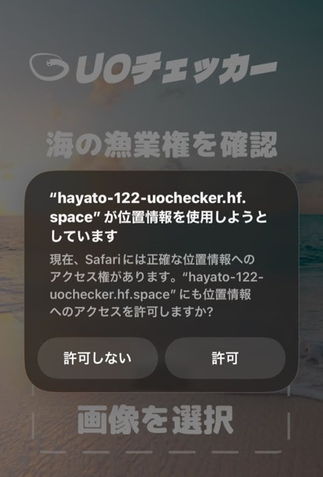

# 🐟️UOchecker

アプリURL : https://hayato-122-uochecker.hf.space/

ユーザーは釣った魚の写真を撮り、アップロードすることで「この魚、なんだろう？」という釣り場での悩みを解決できます。  
**UOchecker** は、アップロードされた画像を解析し、魚種名だけでなく、その地域の漁業権に関する情報を提供します。  
漁業権を確認することで魚の持ち帰りの可否を知ることができるため、法を犯す心配なく安全に釣りを行えます。

## 開発背景

私はYouTubeで釣り動画を視聴していた際に、釣り人が「この魚、貝は取っていいのか？」と毎回現地の漁協や漁師さんに確認し、非常に苦労している場面を見かけました。  
そこで、「もし、撮影した画像から自動で魚種を特定し、その地域の漁業権を確認できるアプリがあれば、釣り初心者の方や釣りが趣味の人がもっと楽に安心して釣りをできるのではないか？」と考えたのが開発のきっかけです。  
このアイデアをIT系専門学校のチーム制作（6名）として開発し、学内コンテストの予選で🏆1位を獲得しました。

## 主要な機能

- 位置情報設定機能
- 画像から魚種の識別および毒性の有無を判定
- 座標の漁業権情報と比較

### 📍位置情報設定機能

|            検索による位置情報設定            |            GPSによる位置情報設定             |
| :------------------------------------------: | :------------------------------------------: |
|  |  |

### 📷画像から魚種の識別および毒性の有無を判定&📍座標の漁業権情報と比較

|                画像のアップロード                |                 結果の表示                 |
| :----------------------------------------------: | :----------------------------------------: |
|  |  |

## 使用技術

| カテゴリ         | 技術                                                                                         |
| :--------------- | :------------------------------------------------------------------------------------------- |
| フロントエンド   | Streamlit (Python 3.13)                                                                      |
| バックエンド     | Python(3.13)                                                                                 |
| 位置情報API      | ArcGIS (Geocoding), HeartRails GeoAPI (Reverse Geocoding), 海洋状況表示システム「海しる」API |
| AI               | Gemini API(gemini-3-flash)                                                                   |
| 仮想化・環境構築 | Docker                                                                                       |
| インフラ         | Hugging Face Spaces                                                                          |
| CI/CD            | Github Actions                                                                               |

## 技術選定理由

**【フロントエンド】**  
開発期間に合わせ、効率的な開発を行えるように学習コストが低く、モダンなデザインを作成でき、デプロイ、ホスティングをしやすいStreamlitを採用しました。

**【バックエンド】**  
魚の判別、AIの利用やAPIを使用するところからAIに強く、リクエスト、レスポンスの処理が単純であるPythonを採用しました。

**【位置情報API】**  
ArcGIS (Geocoding): 日本国内の地名検索において、他のAPIより高精度な座標取得が可能であるため。  
HeartRails GeoAPI (Reverse Geocoding): 取得した座標（緯度経度）から、漁業権照会に必要な「都道府県名・市区町村名」を迅速に特定できるため。  
海洋状況表示システム「海しる」API: 海上保安庁のAPIであり、信用できる日本国内の「第一種共同漁業権」に関する情報を提供しているため。

**【AI】**  
魚種特定にあたって漁業権を持っている魚すべてのアセットデータを入手するのは各地の漁協組合との協力等がないと難しく、現時点ではコネクションや予算等がないため、膨大な学習データで一定の精度が見込める汎用モデルの中でClaude、Chatgptなどと比較して無料で利用できる枠が多い点や、魚の名称判定の精度が高いことからGeminiを選択しました。

**【仮想化・環境構築/インフラ】**  
サーバーにはDockerとの組み合わせや無料で使用できるサーバーの中でCPU、メモリ量がAWSなどの他のサービスより優れているため、より多くのアクセスに耐えられる点からHuggingFaceを使用しています。

**【CI/CD】**  
デプロイの自動化を行い、HuggingFaceへのデプロイをGitHub Actionsを用いて自動化しました。

## インフラ構成図

